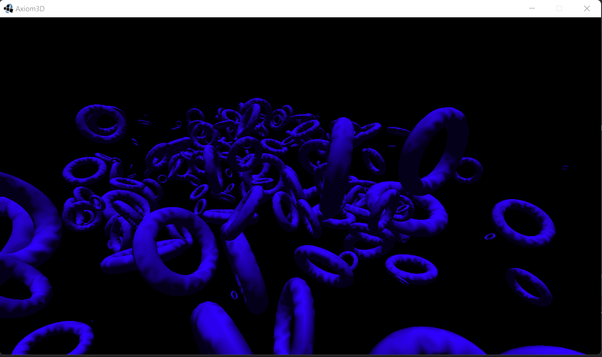
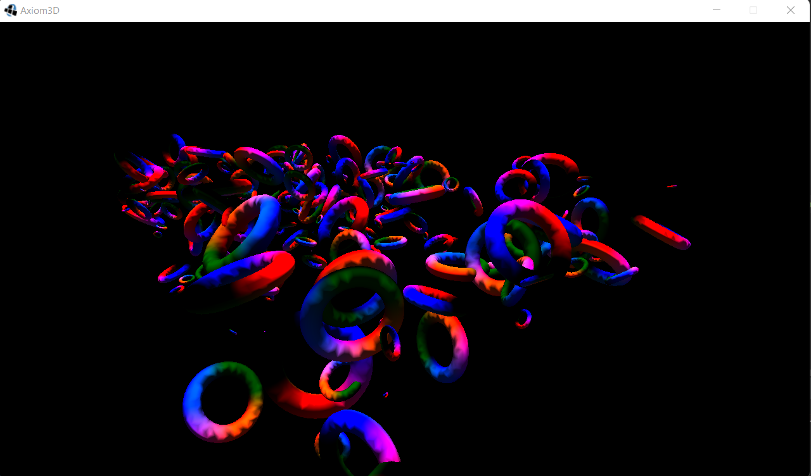
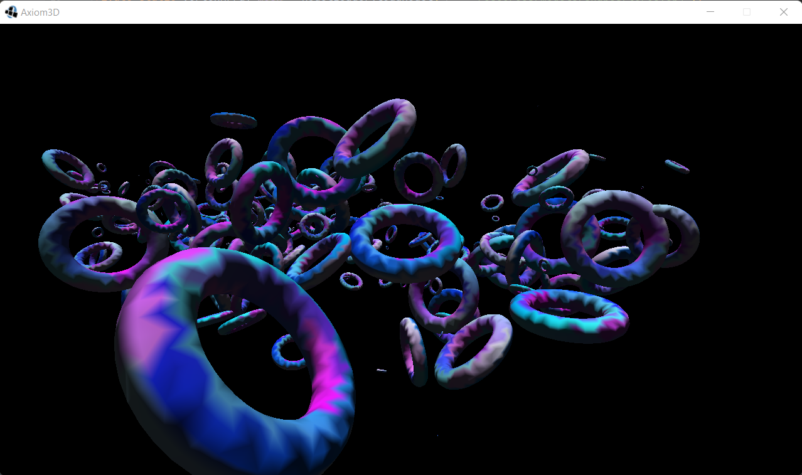
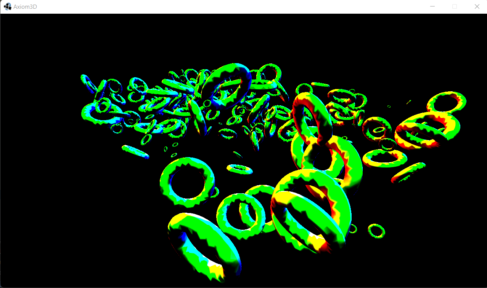
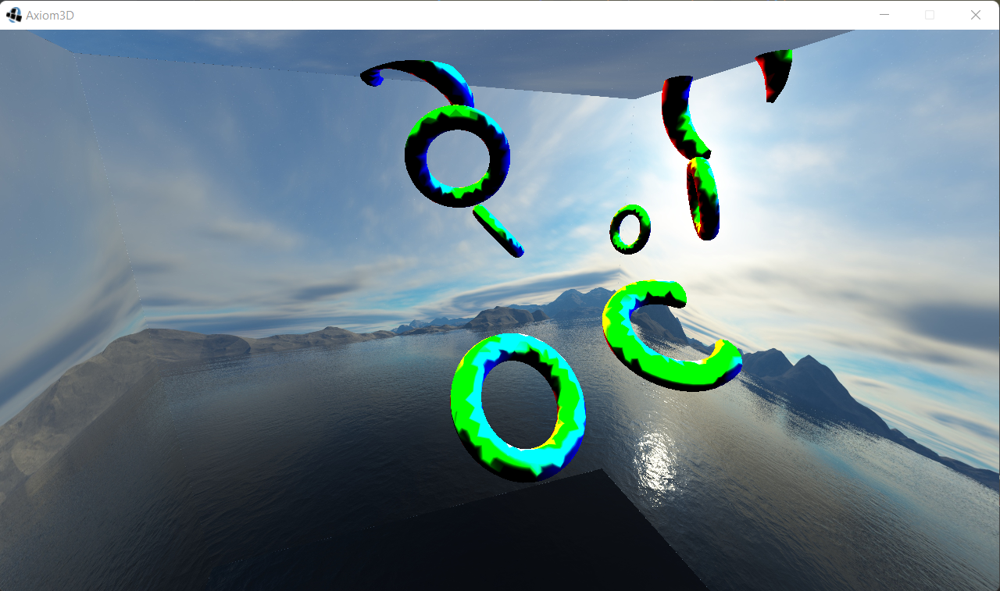
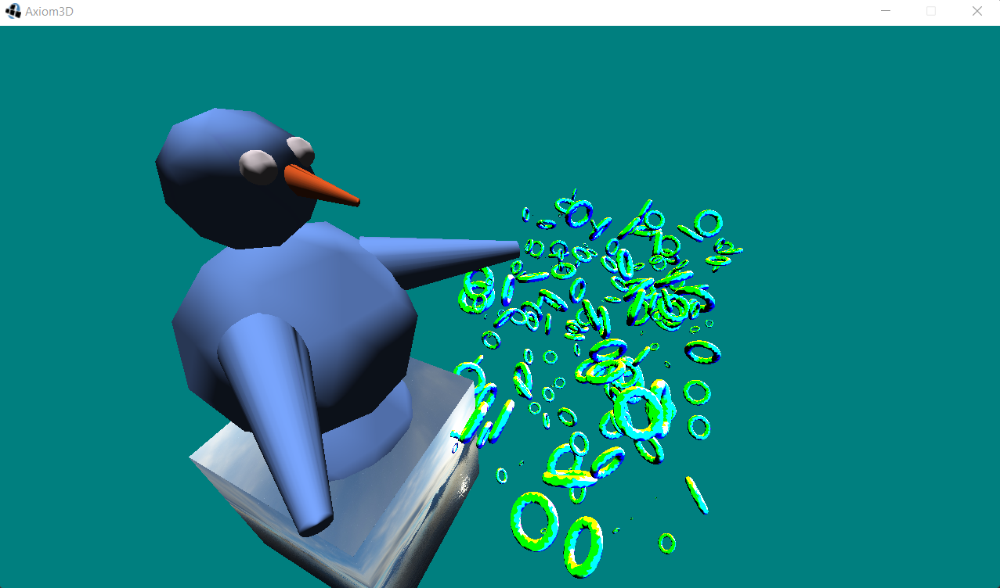

## Axiom 3D
Axiom3D is a simple tool made to apply the knowledge acquired in the field of graphical programming
for now it's very simple by the way I would say a minimalist engine that just allows the display of 3d model and basic lighting I intend to improve it over time by gaining more knowledge and experience in this area.

## Resources 

# Prerequisites

## Math Books & OpenGL

1. 3D Math Primer for graphics & game development
2. 3D Game Development with LWJGL 3

## Tutorials

### 1. Websites

    1. https://learnopengl.com/
    2. http://www.opengl-tutorial.org/fr/beginners-tutorials/

## ScreenShots

> Hypnosis Torus Scene

> Positions Interpolation 

> Uvs Interpolation

> Normals Interpolation

> CubeMap

> Almighty Penguin

